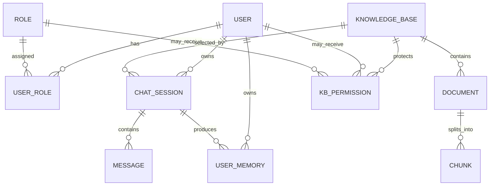

# 实验室招新助手：用户、知识库与记忆关系设计

> **文档状态**：设计草案
> **适用场景**：面向新生的实验室介绍、招新咨询与个性化问答
> **设计目标**：在支持公开问答、用户个性化和内容管理的同时，避免越权检索、记忆串用和个人信息泄露。

## 1. 核心结论

系统中的三类数据必须明确分工：

| 领域 | 回答的问题 | 数据归属 | 典型内容 |
| --- | --- | --- | --- |
| 用户 | “当前是谁、能做什么” | 用户账号与角色 | 身份、角色、状态、权限 |
| 知识库 | “实验室客观上有什么信息” | 实验室或内容负责人 | 实验室介绍、研究方向、招新要求、项目资料 |
| 记忆 | “系统需要为这个人记住什么” | 用户或会话 | 兴趣方向、专业年级、回答偏好、最近对话摘要 |

三者之间的核心关系是：

```text
用户身份决定可访问的知识库
        ↓
知识库提供回答所需的公共事实
        ↓
用户记忆和会话记忆提供个性化上下文
        ↓
三者在通过权限校验后共同进入 Prompt
```

任何个人记忆都不能因为用户访问了同一个知识库，就自动与其他用户共享。知识库是公共事实边界，记忆是个人上下文边界。

## 2. 三个领域的职责边界

### 2.1 用户系统

用户系统负责身份认证、账号状态和权限判断，不负责保存知识正文，也不直接承担对话记忆。

建议首期角色：

| 角色 | 说明 | 主要权限 |
| --- | --- | --- |
| `guest` | 未登录访客 | 查询公开知识库，不保存跨会话长期记忆 |
| `student` | 已注册新生 | 查询公开/登录可见知识库，保存自己的会话和长期记忆 |
| `editor` | 实验室内容管理员 | 管理被授权知识库、文档、Chunk 和索引 |
| `admin` | 系统管理员 | 管理用户、角色、知识库授权和审计数据 |

采用 RBAC：用户与角色使用多对多关系，避免把单个角色字符串写死在用户表中。

### 2.2 知识库系统

知识库负责保存可被检索和引用的客观资料。知识库中的内容原则上不因提问者不同而改变，变化的是用户是否有权访问。

建议可见性：

| 可见性 | 可访问对象 | 示例 |
| --- | --- | --- |
| `public` | 所有人 | 实验室简介、研究方向、招新要求 |
| `authenticated` | 已登录用户 | 报名流程、宣讲材料、面试准备 |
| `restricted` | 被授权用户或角色 | 内部项目、培训资料、成员制度 |

知识库授权至少包含：

- `read`：允许检索和查看来源。
- `write`：允许上传、删除文档和重新索引。
- `manage`：允许修改知识库、分配权限和删除知识库。

权限检查必须发生在向量检索和关键词检索之前。禁止先检索内部内容，再在回答阶段隐藏来源，因为内容已经进入模型上下文。

### 2.3 记忆系统

记忆分为会话记忆和用户长期记忆，两者用途不同。

#### 会话记忆

只负责当前会话的上下文连续性：

- 最近 N 轮消息。
- 超窗后的历史摘要。
- 当前会话选择的知识库。
- 会话标题和软删除状态。

会话记忆的生命周期跟随会话。用户删除会话时先逻辑删除；恢复会话后，历史和摘要继续可用。

#### 用户长期记忆

负责跨会话仍然有价值的用户信息：

- `profile`：专业、年级等基本背景。
- `preference`：兴趣方向、回答风格偏好。
- `fact`：用户明确陈述且后续仍有价值的事实。
- `goal`：希望加入的方向、准备目标等。

长期记忆必须绑定 `user_id`。`session_id` 只表示记忆来源，`kb_id` 可以表示产生记忆时的业务场景，但二者都不能替代用户归属。

访客默认不生成长期记忆。若需要保持同一浏览器中的短期体验，可使用匿名标识保存临时会话，并设置较短过期时间；用户注册后是否合并匿名会话，应由用户明确确认。

## 3. 关系模型

### 3.1 关系总览



主要基数关系：

- 一个用户可以拥有多个角色。
- 一个用户可以创建多个会话。
- 一个会话属于一个用户，也可以暂时属于匿名访客。
- 一个会话在当前实现中选择一个知识库；以后可扩展为一次查询多个授权知识库。
- 一个用户拥有多条长期记忆。
- 一条长期记忆可以记录来源会话，但归属始终是用户。
- 一个知识库包含多个文档，一个文档包含多个 Chunk。
- 用户或角色通过授权表获得知识库权限。

### 3.2 推荐数据表

#### 用户与角色

```text
users
- id
- username
- password_hash
- nickname
- email
- status                 active / disabled
- created_at
- updated_at
- last_login_at

roles
- id
- code                   guest / student / editor / admin
- name

user_roles
- user_id
- role_id
```

#### 知识库授权

```text
knowledge_bases
- id
- name
- description
- visibility             public / authenticated / restricted
- owner_id
- embedding_model
- status
- created_at
- updated_at

knowledge_base_permissions
- id
- kb_id
- subject_type           user / role
- subject_id
- permission             read / write / manage
```

`subject_type + subject_id` 允许同一张表同时表达“授权给某个用户”和“授权给某个角色”。

#### 会话与消息

```text
sessions
- id
- user_id                登录用户；匿名会话可空
- anonymous_id           匿名会话可用；登录会话为空
- knowledge_base_id
- name
- summary                压缩后的会话摘要
- name_source            ai / user
- deleted_at
- created_at
- updated_at

messages
- id
- session_id
- role                   user / assistant / system
- content
- created_at
```

`name_source=user` 表示用户手动命名，AI 后台任务不得覆盖；这与现有“用户命名优先”的行为保持一致。

#### 用户长期记忆

```text
user_memories
- id
- user_id
- memory_type            profile / preference / fact / goal
- content
- confidence
- source_session_id
- status                 active / deleted
- created_at
- updated_at
- expires_at
```

MySQL 保存记忆的可管理副本、状态与审计信息；ChromaDB 保存向量及检索元数据。向量元数据至少包括：

```json
{
  "memory_id": "mem_xxx",
  "user_id": "user_xxx",
  "memory_type": "preference",
  "source_session_id": "sess_xxx"
}
```

建议使用一个 `user_memories` collection，并在查询时按 `user_id` 强制过滤。不要为每个用户建立一个 collection，避免产生大量小集合。

## 4. 权限与检索链路

一次问答的推荐执行顺序：

```text
1. 解析登录态或匿名身份
2. 校验账号是否可用
3. 校验会话归属：session.user_id == current_user.id
4. 计算用户可读知识库集合
5. 校验请求中的 kb_id 是否在可读集合内
6. 只在授权知识库中执行关键词检索和向量检索
7. 只按 current_user.id 召回长期记忆
8. 从当前 session 读取摘要与最近 N 轮消息
9. 组装 Prompt 并生成回答
10. 保存消息，后台提取当前用户的长期记忆
```

服务层应集中提供权限函数，避免每个接口各写一套判断：

```text
require_authenticated_user()
require_session_owner(session_id, current_user)
require_kb_permission(kb_id, current_user, "read")
list_readable_kb_ids(current_user)
```

知识库管理接口使用 `write/manage`，聊天检索使用 `read`。

## 5. Prompt 中三者的组合方式

推荐上下文顺序：

```text
System Prompt
→ 用户长期记忆
→ 授权知识库检索结果
→ 会话历史摘要
→ 最近 N 轮消息
→ 当前问题
```

各段职责：

- System Prompt：定义助手身份、安全边界和回答规则。
- 用户长期记忆：提供个性化信息，不作为实验室客观事实来源。
- 知识库结果：提供可引用、可追溯的事实依据。
- 会话摘要与最近消息：处理代词、追问和上下文连续性。
- 当前问题：保持为原始用户问题，不能被 Query Rewrite 替换。

必须在提示词中声明：

1. 实验室事实只能以知识库检索结果为依据。
2. 用户记忆只用于个性化和上下文补充。
3. 用户记忆与知识库冲突时，以知识库资料为准，并提示用户确认个人信息是否过期。
4. 检索不到资料时明确说明，不使用个人记忆编造实验室事实。

## 6. 数据生命周期与级联影响

### 6.1 用户被禁用

- 禁止登录和访问所有受保护接口。
- 保留用户、会话和记忆，便于管理员恢复账号。
- 不立即删除知识库内容，因为知识库可能属于实验室而不是个人。

### 6.2 用户注销或物理删除

- 逻辑删除用户并停止登录。
- 逻辑删除其会话。
- 删除或匿名化个人长期记忆。
- 用户上传到公共知识库的文档是否删除，由知识库所有权规则决定，不能直接级联删除。
- 保留必要审计记录，但移除可识别个人的信息。

### 6.3 会话删除

- 用户主动删除：设置 `deleted_at`，消息与会话摘要暂时保留，可恢复。
- 软删除期间默认不召回该会话的短期历史。
- 由该会话提取出的长期记忆不应立即删除，因为它已成为用户级信息；用户可在“我的记忆”中单独删除。
- 达到物理清理期限后删除会话和消息，长期记忆仅清除 `source_session_id` 或按隐私策略处理。

### 6.4 知识库删除

- 删除或归档知识库授权关系。
- 删除文档、Chunk、向量 collection 和上传文件。
- 关联会话不应物理删除，应将知识库标记为不可用，并保留历史消息供用户查看。
- 用户长期记忆不随知识库删除，因为它归用户所有；若记忆只在该知识库语境下有效，可增加 `scope_kb_id` 并将其停用。

### 6.5 角色或权限变更

- 权限变更立即影响下一次检索。
- 已有历史回答可以继续展示，但再次提问时不得继续访问已撤销的知识库。
- 前端缓存的知识库列表必须刷新，后端不能依赖前端隐藏按钮保障权限。

## 7. 隐私与安全边界

- 密码只保存 Argon2 或 bcrypt 哈希。
- 认证令牌不写入日志；长期刷新令牌优先使用 HttpOnly Cookie。
- 查询 ChromaDB 用户记忆时，`user_id` 过滤是强制条件，不能由前端传入并直接信任。
- 用户只能查看、修改和删除自己的长期记忆。
- 内容管理员可以管理知识库，但默认不能查看新生私人记忆。
- 系统管理员对个人记忆的访问应记录审计日志，并尽量只开放统计结果。
- 不自动提取身份证号、手机号、家庭住址等非必要敏感信息；即使模型返回，也应由规则过滤。
- 访客数据设置短期过期时间，避免为未登录用户建立永久画像。

## 8. 对现有实现的影响

当前项目已经具备知识库、会话、短期记忆和长期记忆，但加入多用户后需要重点调整以下位置：

| 当前实现 | 多用户风险 | 目标调整 |
| --- | --- | --- |
| `sessions` 没有 `user_id` | 无法判断会话归属 | 增加 `user_id/anonymous_id` 并在接口层校验 |
| 长期记忆按 `kb_id` 共享召回 | 同一知识库的新生会互相读到个人偏好 | 改为按 `user_id` 强制过滤 |
| `kb_{kb_id}_memory` | 将个人记忆错误绑定到知识库 | 迁移到统一 `user_memories` collection 或增加用户过滤 |
| 知识库没有可见性和授权表 | 所有人可能访问所有知识库 | 增加 `visibility` 和 `knowledge_base_permissions` |
| 会话摘要主要是运行时状态 | 重启后需要重算 | 将最终摘要持久化到 `sessions.summary` |
| 记忆清理由 `session_id` 驱动 | 不便于用户管理跨会话画像 | 增加按 `user_id/memory_id` 查看、删除和停用接口 |

其中最高优先级是长期记忆隔离。现有“同一知识库内跨会话共享”的设计只适合本地单用户模式，上线招新系统前必须改成用户级隔离。

## 9. 推荐接口

```text
# 认证与用户
POST   /api/auth/register
POST   /api/auth/login
POST   /api/auth/refresh
POST   /api/auth/logout
GET    /api/auth/me

# 用户自己的记忆
GET    /api/users/me/memories
PUT    /api/users/me/memories/{memory_id}
DELETE /api/users/me/memories/{memory_id}
DELETE /api/users/me/memories

# 管理员用户与角色
GET    /api/admin/users
PUT    /api/admin/users/{user_id}/status
PUT    /api/admin/users/{user_id}/roles

# 知识库权限
GET    /api/knowledge-bases
POST   /api/knowledge-bases/{kb_id}/permissions
DELETE /api/knowledge-bases/{kb_id}/permissions/{permission_id}
```

现有聊天接口保留，但服务端从认证上下文获取用户身份，不能接受客户端直接提交可信的 `user_id`。

## 10. 分阶段实施建议

### 阶段 A：身份与会话归属

1. 新增 `users/roles/user_roles`。
2. 完成注册、登录、刷新和退出。
3. 为 `sessions` 增加 `user_id/anonymous_id/summary/name_source`。
4. 所有会话接口增加归属校验。

### 阶段 B：知识库授权

1. 为知识库增加 `visibility/owner_id/status`。
2. 新增 `knowledge_base_permissions`。
3. 在文档、Chunk、重索引和聊天检索入口统一校验权限。
4. 前端根据权限显示功能，但以后端校验为准。

### 阶段 C：记忆用户化

1. 新增 MySQL `user_memories` 管理表。
2. 长期记忆提取接口增加可信的 `user_id` 参数。
3. ChromaDB 改为 `user_id` 过滤召回。
4. 提供“我的记忆”查看、修改和删除页面。
5. 将会话摘要持久化。

### 阶段 D：隐私与运营

1. 增加登录、权限变更、知识库管理审计日志。
2. 增加敏感信息过滤与数据保留期限。
3. 提供招新问题的匿名统计，不暴露个人对话正文。
4. 增加账号注销和个人数据导出能力。

## 11. 验收边界

完成设计落地后，至少应满足：

- 访客只能查询公开知识库。
- 新生 A 无法读取新生 B 的会话、长期记忆和受限知识库。
- 内容管理员能管理知识库，但不能默认查看新生个人记忆。
- 权限撤销后，下一次检索立即无法命中对应知识库内容。
- 同一用户的新会话可以召回其有效长期记忆。
- 删除会话不会误删公共知识库，也不会自动删除用户确认保留的长期记忆。
- 删除知识库不会删除用户账号和个人会话历史。
- 用户能够查看并清理系统保存的个人记忆。
- 回答中的实验室事实来自授权知识库，并保留来源引用。

## 12. 最终设计原则

1. **身份先于检索**：先确认用户和权限，再执行任何召回。
2. **公共事实与个人信息分离**：知识库存事实，记忆存用户上下文。
3. **记忆归用户，不归知识库**：知识库只限定业务语境，不能作为个人记忆隔离键。
4. **会话归用户，摘要归会话**：短期上下文不能跨用户共享。
5. **前端只改善体验，后端负责安全**：按钮隐藏不能替代权限校验。
6. **删除边界清晰**：删除用户、会话、知识库、记忆分别处理，禁止无意级联。
7. **用户可知、可查、可删**：长期记忆必须对用户透明并可管理。
